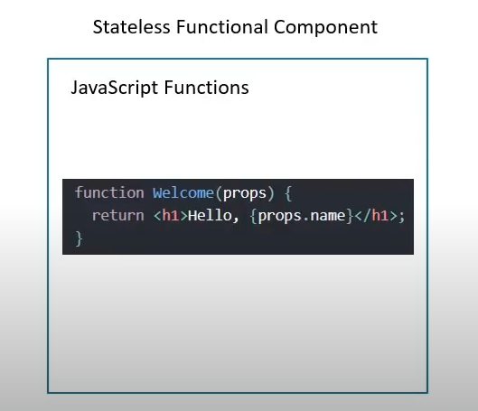

# Codevolutions React Tutorial

## 1. Introduction

* In this series we will start from scratch and learn different concepts of react
* In this video we will talk about what is react, why we should learn react & future content

* We also will go over the prerequisites of what to learn react

### What is React?

* It is an open source javascript library for building user interfaces
* React is a Javascript library and is **not a framework**
* It focuses on one thing and doing one thing really well, **building user interfaces**
* It does not focus on routing or http requests
* React has a rich ecosystem and plays well off other libraries to build full fledged applications

### Why learn React?

* React is a project created and maintained by facebook, as such it's got a huge backing and has money & resources for the project to be kept alive
* It has more than 100k stars on github
* Additionally it has a huge community
* Also from a stackoverflow survey, it is one of the most used libraries and is one of the most in demand skillsets right now

### Component Based Architecture

* React uses a componennt based architecture, this bascially breaks down a website into component based parts which is great for encapsulation
* I.e a traditional website can be broken down into
  

### Reusable Code

* Components also allow reusable code
* I.e we can make a react component for articles
* We can then use this article for a react, angular and vue article after the fact
* Especially for enterprise solutions this is a huge benefit

### React is declarative

* We just tell react what we want and react through the REACTDOM will build the UI
* This is a declarative paradigm, which alternative to the imperative paradigm is where we do it line by line
* I.e we go to an artist and tell them what has to be done, whilst we would tell a 5 year old child what to do, which we'd say instruction by instruction.
* React helps to abstract away the complicated parts
* React will handle efficentvely updating and rendering of the components
* DOM updates are also handled gracefully in react

### More on why React?

* React seamlessly intergrates react into any of your applications
* A small sub-section or the entire application can be done into react
* Additionally once getting familar with react, we can venture into mobile applications through react-native

### Prerequisites

* HTML, CSS & JavaScript fundamentals are necessary
* ES6 is also mandatory
* JavaScript - 'this' keyword, filter, map and reduce
* ES6 - let & const, arrow functions, template literals, default parameters, object literals, rest and spread operators, destructuring assignments
* We will be learning react from scratch

### Guideline

  

## 2. Hello World

* We will start this by making our development environment, to start we first need two things:
  * Node
  * Visual Studio Code
* To create a new react application we will be making use of `Create React App`
  * This is great as we can quickly generate the template files for a react application by running a command
  * In VSC run the command
  ```
  npx create-react-app nameOfProject --template typescript
  npm start (alternatively yarn start in wsm which is a lot faster)
  ```
* To edit the project, go to the App.tsx file and change the content
  * For now we will change the text to now say `Hello World!`
* When the changes are made the react project will automatically update the items

* Before the next video, we will also show an alternative method of creating a react project
    * In the first method we used npx, which is a npm package runner
    * There is also a slightly different mode which is through the npm, we could install the npm package globally and run it through create-react-app
    ```
    npm install create-react-app -g
    create-react-app <project name>
    ```

## 3. Folder Structure

* In this video we will be talking about the root structure of the program
  

  * **package.json** - Contains the key files, dependencies and the scripts to run the react project
  * **package-lock.json** - Depending on our package manager we have package-lock for our yarn files.
  * **node_modules** - This is our folder for where all our dependencies are installed
  * **public** - This is our public folder which contains the public info
    * **manifest.json** - this is for progressive web-apps which is out of scope
    * **favicon.ico** - this is the main icon of the app
    * **index.html** - This index.html file is the only html file in our application, we are building single page application and this is it. The view may change dynamically on our browser but this is what turns up
      * We typically won't add any code in this project, maybe in the head but not iin the body
      * We have one div, where id="root", in runtime our react app takeovers the div which makes up our ui
    * **src** - This is our main folder which the majority of our application is going to be developed on.
      * **index.tsx** - This contains our "main" application which takes over the main-component of the root div, through the DOM
      * **app.tsx** - This is the root component that is rendered via index.tsx which is rendered on the html file. The app component is the view which we see on our view browser
      * **app.css** - This is a css file for styling
      * **App.test.tsx** - This is a file for simplistic unit tests

* When we run the command `yarn start`
  * Index.html file is served in the browser
  * Index.html contains the root DOM node
  * Next index.tsx renders the root component of the dom node
  * App.tsx contains the components to be rendered in index.tsx

## 4. Components

* In react, a component represents a part of the user interface
* Going back to the earlier example in the previous video, we can say our website has 5 components
  * Root component
    * Header
    * Sidenav
    * Main content
    * Footer
* Components are also reusable
  * The same components can be used with different properties to display differently i.e the left sidenav can be just a sidenav so it can also become a right sidenav

### Components In Code

* A component code is usually placed in a typescript folder
* I.e the AppComponent files are placed in the App.tsx files
* What does the code look like?
  * This depends on the type of the component

### Component Types

* In React there are two component types:
  * Stateless Functional Component
  * Stateful Class Components

* Functional components are JavaScript functions that return html files that describes the UI
  * 

* Class Components alternatively extend from the component class from the react library.
  * They must contain a render method that contain the return of html
  *    

## 5. Functional Components

* Functional components are just javascript function
  * They can also take an optional object of properties (which is called props)
  * They output a HTML file called JSX / TSX
* This is pretty much a typescript function that takes in props and outputs a html file
  

### Making A Functional Component

* In the app component we will remove all the html excluding the main `div` tag
* We will now create a functional component that will say `Hello Shaan`
* Make a new file called `Components/Greet.tsx`

```tsx
import React from 'React';

let Greet = () => {
    return (<div>Hello Shaan Khan</div>);
};

export default Greet;
```

* From this we can then import the functional component into `App.tsx` by

```tsx
import Greet from './Components/Greet.tsx';

<Greet/>
```

* We can see that it now appears in our program
* One additional important thing about exporting / importing
  * See we are exporting it as a default, now this is how we are able to import it with any name
  * If we weren't we would have to use a thing called Aliasing

```tsx
export const Greet = () => ();
```

```tsx
import {Greet} from './Components/Greet.tsx'
```

# 6. Class Components

* Class components are like ES6 classes
* Similar to Components, they also take props as an input and return html
* Additionally these can also contain a private internal state, i.e contain some information that is private to this UI and allows it to contain some private state to relay to the user interface
* We will now make the same greet component but now as a class component
* When we make a class component, unlike functional components we need two imports
  
```tsx
import React, { Component } from "react";

class Welcome extends Component {
  render() {
    return <h1>Hello World</h1>;
  }
}

export default Welcome;
```

* This works like a normal functional component, instead of using a function we instead return a Welcome class which **extends component**.
* This additionally needs the interface `render()` implemented which returns the html

### Class Components vs Functional Components

#### Functional

* Functional components are simple functions which takes in props and returns a declaration
* We should try using a functional component as much as possible (if possible to do functional compared to class components choose functional)
* The benefit is we have the absence of the `this` keyword
* Additionally we are forced of doing a solution without using state, state whilst a good advanced concept is hard for beginners
* Functional components are mainly responsible for the UI
* This is why functional components are called Stateless / Dumb / Presentational components

#### Class Components

* These are more feature rich
* They maintain their own private data, ccalled states
* They can facilitate complex UI logic
* These provide a thing called **lifecycle hooks**
* These components are also called Stateful / Smart / Container

## 7. Hook Updates

* This cool new feature which updated contradicts what we learnt about functional vs state components
* We mentioned that class components have the benefit of a thing called state / lifecycle hosts, we also mentioned functional components as stateless components.
* We now have a thing called hooks, which are a new feature that lets you use state and other react features without using a class

## 8. JSX

* JSX / TSX is a word going to be told a lot in the word of react
* Javascript XML (JSX) is an extension to the JavaScript language syntax.
* This allows us to write XML-like code for elements and components
* JSX has tags and have a tag name, attributes and children
* Whilst it isn't a necessitiy to code a react tutorial, JSX makes our code simpler and elegant
* JSX ultimately transpiles into pure JS which is understood by browsers

* We will now show you a react component coded in JSX and one made without JSX

### Hello.tsx

```tsx
import React from 'react'

const Hello = () => {
    return (
        <div>
            <h1>Hello Shaan</h1>
        </div>
    );
}

export default Hello;
```

### Hello.ts

```ts
import React from 'react'

const Hello = () => {
    return React.createElement('div', null, React.createElement('h1', null, 'Hello Shaan'));
};

export default Hello;
```

* As we can see this is a lot more annoying
* React.createElement renders it, we use div, null the second term and then the thing being displayed
* The null / second one is the key-value pair, we get id="hello" if we replace null with hello
  ```ts
  {id: 'Hello', className: 'World'}
  ```

### JSX Differences

* Class -> className
* for -> htmlFor
* camelCase property naming conventions
  * onclick -> onClick
  * tabindex -> tabIndex

## 9. Props

* In the video about components, we said components are reusable
* For example lets say we need to reuse the greet component, we just have to remention the greet tab component another time
* If we wanted to make this component more generic, we need to make a way to allow the component to take an argument to display a different name

* This is where react properties or props come into play, it also allows the component to be dynamic
  * Our intention is to parse a name in the react component and display that name in the browser
  * To specify a name property to the prop we add an attribute
```tsx
<GreetProp name = "John Doe"/>
```

```tsx
import React from "react";

let WelcomeProp: React.FC<{ name: string }> = (props) => {
  console.log(props);
  return (
    <div>
      <h1>Hello {props.name}</h1>
    </div>
  );
};

export default WelcomeProp;
```

* As we can see when we print props we see it returns an object which contains props.name as the name, by adding the :React.FC we just explicitly type it in react

* Additionally react in TSX typically evaluates all words as text unless we use curly braces, which flips the code from html to JS

* Sometimes it also possible we don't have an idea of what data will be rendered in, we can do this by putting the data inside of the open and closing tags of the object and retriving the inside data via the props.children

```tsx
<GreetProp name="Hero man">
    <p>This is children prop</p>
</GreetProp>
```

```tsx
import React from "react";

let WelcomeProp: React.FC<{ name: string }> = (props) => {
  console.log(props);
  return (
    <div>
      <h1>Hello {props.name}</h1>
      {props.children}
    </div>
  );
};

export default WelcomeProp;
```

* Also be aware that TSX can only return a single parent element, so it needs to be wrapped

* Now we will repeat the same thing using a class component

```tsx
import React, { Component} from 'react'

class Welcome extends Component {
    render() {
        return <h1>Welcome {this.props.name}</h1>
    }
}

export default Welcome
```

* Basically to access the props component on a class component we need to use the `this` keyword

* There is one significant thing about props however, **props are immutable i.e they cannot be changed again, they cannot be changed they are read only**